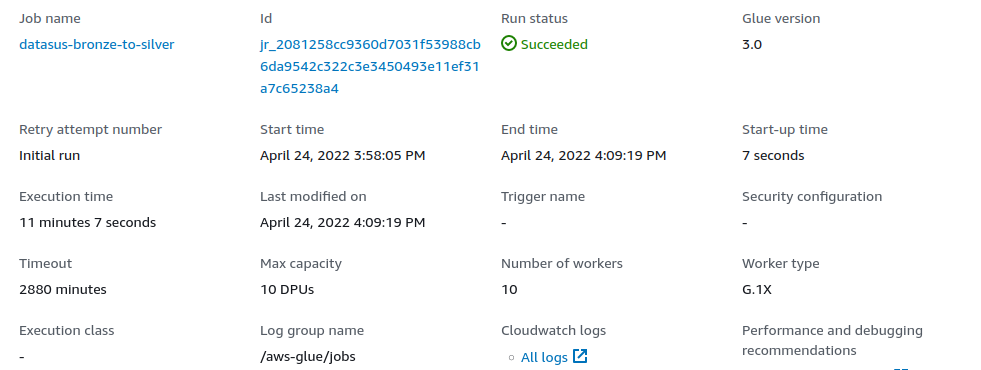
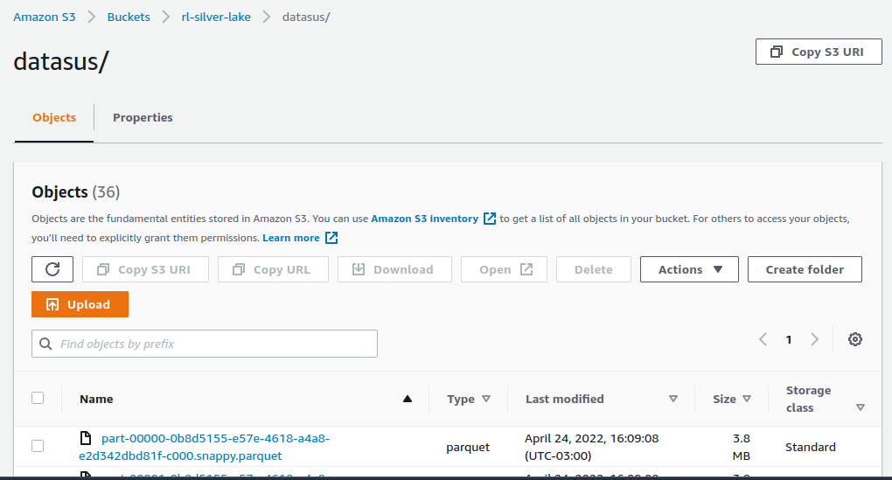
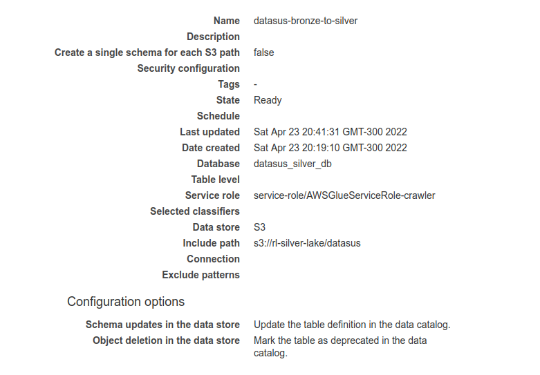
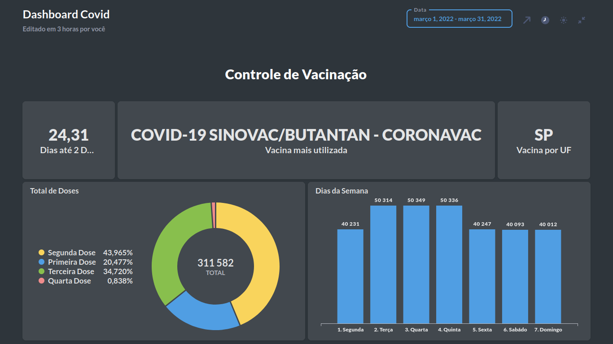

# Data Lake Serveless - V0
O projeto foi realizado na cloud da AWS, se beneficiando do serviços em free tier.

## Requisitos e informações
Replicar as visualizações do site “https://covid.saude.gov.br/”, porém acessando
diretamente a API do Elastic.

Link oficial para todas as informações:
https://opendatasus.saude.gov.br/dataset/covid-19-vacinacao

Informações para se conectar ao cluster:

- URL https://imunizacao-es.saude.gov.br/_search
- Nome do índice: desc-imunizacao
- Credenciais de acesso
    - o Usuário: imunizacao_public
    - o Senha: qlto5t&7r_@+#Tlstigi

## Requisitos
Para o seguinte projeto é necessário que você possua conhecimentos em:

- Pyspark | Intermediário.
- ElasticSearch (Query, search_after) | Básico.
- AWS Cloud e toda a stack utilizada no projeto | Básico.
- Python | Intermediário.
- Docker | Básico

## Stack
- Lambda
- S3
- Glue
- Athena
- Docker Metabase

# Camada Bronze

## Lambda
Lambda é um serviço serveless da AWS que pode ser utilizado em diversos projetos seja como gatilho para iniciar algum outro serviço da AWS ou até mesmo trazer dados de API.

A ideia de utilizar a Lambda é conseguir trazer o máximo de dados de forma paralela utilizando duas Lambdas. Contudo, irei trazer dados entre 01/01/2022 e 31/03/2022, e mesmo assim aproxidamente 23 lambdas irão dar erro de timeout.

Como é um mini-projeto não vejo problemas pois acredito que esta função será melhor utilizada para webhooks e trazer os dados de forma diária, no caso minha ideia é que o projeto seja o mais barato o possível.

Pasta onde guardei o código da [lambda](lambda/)

## Covid-intake

- Linguagem Python 3.9
- 2024MB de Memória RAM.
- 1024MB de Memória Interna.
- 10 minutos de timeout.
- Importar Layer "Requests", (É igual dar um pip install requests, porém você terá que baixar a biblioteca e importar para sua Lambda através da Layer)

Como afirmei acima, não foi possível ter 100% de sucessos das lambdas com todos os dados por causa do tempo de timeout, isso ocorre por causa do filtro que estou utilizando na minha query do Elastic que é "vacina_dataAplicacao", ela informa quando a pessoa foi vacinada. Este foi o menor range possível que consegui encontrar para obter os dados de forma que a Lambda consiga trazer o mais rápido possível.

## Covid-splitter

- Linguagem Python 3.9
- 128MB de Memória RAM
- 512 MB de Memória Internar.
- 3 minutos de timeout.
- Não é necessário importar layer.

Essa Lambda é quem irá invocar todas as Lambdas da Covid-intake utilizando a data necessária, ela quem será o meu trigger para invocar o restantes das Lambdas, no meu caso estou utilizando um range de 90 dias, por tanto, 90 Lambdas funcionando ao mesmo tempo.

## S3
O S3 é o serviço de armazenamento da Amazon, nesse projeto serão aproxidamente 20GB de armazenados.

Após a configuração das Lambdas e seu código pronto, é necessário criar ao menos 1 bucket no S3 como seu target para enviar os dados, no meu caso eu criei o rl-bronze-lake, e também será necessário criar o rl-silver-lake quando for processar os dados pelo Glue.

Camada bronze finalizada, é claro que em um ambiente de produção teriamos que trabalhar em algo muito mais robusto, com padrão de tags e o máximo de perfomance o possível com tratamento de erros no seu código, porém o tempo para esse projeto é curto.

# Camada Silver

## Glue
Glue é um serviço da AWS que realiza ETLs e tem capacidade de catalogar suas tabelas para serem utilizadas por analistas posteriormente. O job do Glue é onde fica seu script em spark para processar e deixar seus dados na formatação correta, já o Crawler serve para catalogar os dados processados e neste caso ser enviado para o AWS Athena.

Observação: na Amazon o Athena não é propriamente um Banco de Dados OLAP ou OLTP, ele serve para você fazer consultas SQL para qualquer tipo de arquivo propriamente tratao como json, csv, parquet e afins. Por isso, que utilizamos ele após o processamento do Job no Glue.

Como citado anteriormente, foi necessário criar outro bucket para guardar os arquivos que serão processados nessa camada, o script spark que utilizei está na pasta [glue](glue/).

Após rodar o job, é possível verificar no bucket os arquivos processados da silver, de 20Gb foi reduzido para 140Mb aproxidamente, isso ocorre pois na minha query já estou retirando a duplicidade de dados.

Por fim, crie um Crawler ainda utilizando o Glue, aponte para o bucket da silver e crie um banco de dados no Athena para ser possível retirar insights e análises.

Finalizada a Camada Silver.

# DataViz

## Metabase
Você pode utilizar N ferramentas de dataviz como o PowerBi, Tableau e afins para conseguir se conectar ao Athena que foi criado na Camada Silver, no meu caso eu subi a ferramenta de dataviz "metabase" seguindo o tutorial do Murilo, segue o link:
- https://muriloalvesdev.medium.com/conectando-metabase-ao-athena-aws-utilizando-docker-8cef92980597 

Só uma observação, na hora de fazer o download do jar, procure a versão mais atualizada dele no mesmo repositório do dacort, também é possível subir o metabase por EC2 na nuvem, pensando em disponibilizar isso para a sua empresa e lembrando, Metabase é uma ferramenta de dataviz open source.

Por fim, temos nosso dashboard após a configurações. Também estarei deixando minhas queries no repositório [query](query/).

