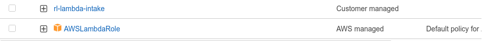
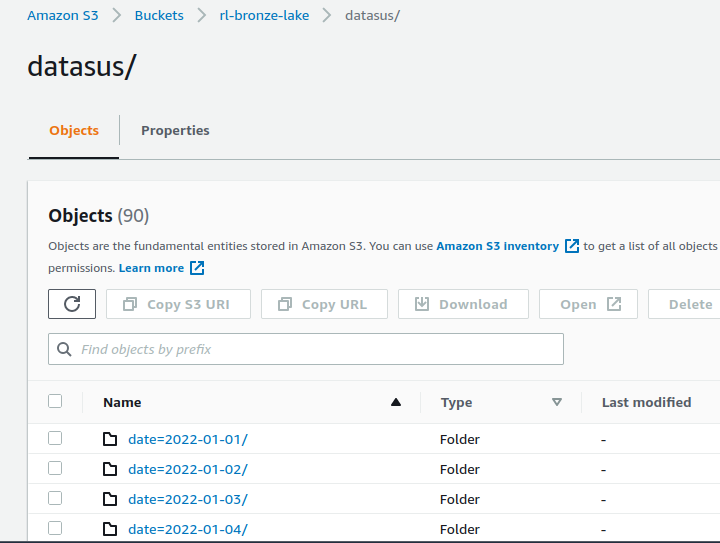

# Data Lake Serveless - V0
O projeto foi realizado na cloud da AWS, se beneficiando do serviços em free tier.

## Requisitos e informações
Replicar as visualizações do site “https://covid.saude.gov.br/”, porém acessando
diretamente a API do Elastic.

Link oficial para todas as informações:
https://opendatasus.saude.gov.br/dataset/covid-19-vacinacao

Informações para se conectar ao cluster:

- URL https://imunizacao-es.saude.gov.br/_search
- Nome do índice: desc-imunizacao
- Credenciais de acesso
    - o Usuário: imunizacao_public
    - o Senha: qlto5t&7r_@+#Tlstigi

## Requisitos
Para o seguinte projeto é necessário que você possua conhecimentos em:

- Pyspark | Intermediário.
- ElasticSearch (Query, search_after) | Básico.
- AWS Cloud e toda a stack utilizada no projeto | Básico.
- Python | Intermediário.

## Stack
- Lambda
- S3
- Glue
- Athena
- EC2 / Metabase

# Camada Bronze

## Lambda
Lambda é um serviço serveless da AWS que pode ser utilizada para n serviços enviando eventos ou fazendo algo simples com o código.

A ideia de utilizar a Lambda é conseguir trazero máximo de dados de forma paralela, isso referente ao ano de 2022. Ao total serão duas Lambdas. Cotundo, irei trazer dados entre 01/01/2022 e 31/03/2022, e mesmo assim aproxidamente 23 lambdas irão dar erro de timeout, porém não tem problema pois acredito que esta função será melhor utilizada para webhooks e trazer os dados de forma diária, como o caso da covid é algo excepcional e o projeto é para ser o mais barato o possível, resolvi utilizar Lambda em vez do API Gateway.

## Roles Lambda
Antes de mais nada é necessário criar sua role para suas Lambdas, é ela quem vai permitir que sua Lambda consiga acessar o Bucket S3, ou então, invocar outras Lambdas.
Não configurei logs e cloudwatch para minha role afim de evitar custos, mas é essêncial que em um ambiente de produção você coloque a policy de logs e cloudwatch.

Crie a seguinte policy e depois faça o attach na sua role para a Lambda.

    {
     "Version": "2012-10-17",
     "Statement": [
         {
             "Sid": "VisualEditor0",
             "Effect": "Allow",
             "Action": [
                 "s3:PutObject",
                 "s3:PutObjectAcl",
                 "s3:GetObject",
                 "s3:GetObjectAcl",
                 "s3:ListBucket"
             ],
             "Resource": "arn:aws:s3:::*"
         },
         {
             "Sid": "VisualEditor1",
             "Effect": "Allow",
             "Action": "s3:ListBucket",
             "Resource": "arn:aws:s3:::*"
         }
     ]
    }

E attach a policy AWSLambdaRole que já existe por default na AWS.

## Covid-intake
Utilizei as seguintes configurações para esta Lambda:

- Linguagem Python 3.9
- 2024MB de Memória RAM.
- 1024MB de Memória Interna.
- 10 minutos de timeout.
- Importar Layer "Requests", (É igual dar um pip install requests, porém você terá que baixar a biblioteca e importar para sua Lambda através da Layer)

Como afirmei acima, não foi possível ter 100% das lambdas com todos os dados por causa do tempo de timeout, isso ocorre por causa do filtro que estou utilizando na minha query do Elastic que é "vacina_dataAplicacao", ela informa quando a pessoa foi vacinada. Este foi o menor range possível que consegui encontrar para obter os dados de forma que a Lambda consiga trazer o mais rápido possível.

## Covid-splitter

- Linguagem Python 3.9
- 128MB de Memória RAM
- 512 MB de Memória Internar.
- 3 minutos de timeout.
- Não é necessário importar layer.

Essa Lambda é quem irá invocar todas as Lambdas da Covid-intake utilizando a data necessária, ela quem será o meu trigger para iniciar o restantes das Lambdas, no meu caso estou utilizando um range de 90 dias, por tanto, 90 Lambdas funcionando.

## S3
O S3 é o serviço de armazenamento da Amazon, nesse projeto serão aproxidamente 40GB armazenados, o que irá gerar um custo mínimo, caso não queira gastar basta diminuir o range de data do Covid-splitter para ficar até 2GB, e não se esqueça que a cobrança é de até 2000 PUT no S3, ou seja, você consegue enviar 2000 objetos de graça, o restante paga, irei abordar de forma mais detalhada sobre os preços ao final do documento.

Após a configuração das Lambdas e seu código pronto, é necessário criar ao menos 1 bucket no S3 para ai só depois você rodar o código, no meu caso eu criei o rl-bronze-lake, e também será necessário criar o rl-silver-lake quando for processar os dados pelo Glue.

Pronto, você finalizou a camada bronze do seu datalake, é claro que em um ambiente de produção teriamos que trabalhar em algo muito mais robusto, com padrão de tags e o máximo de perfomance o possível e tratamento de erros no seu código, porém o tempo para esse projeto é curto, então mão na massa para a camada Silver.

# Camada Silver

Em trabalho ainda...